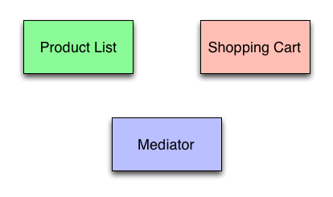
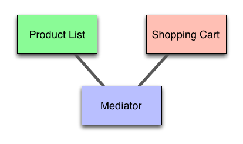
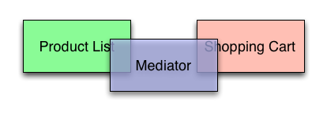
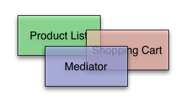
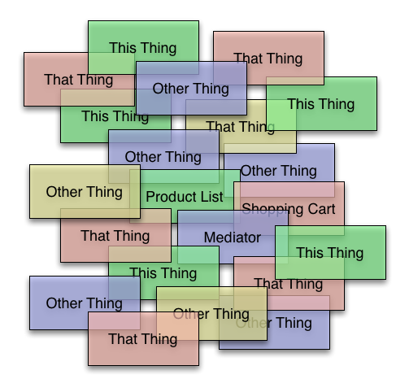
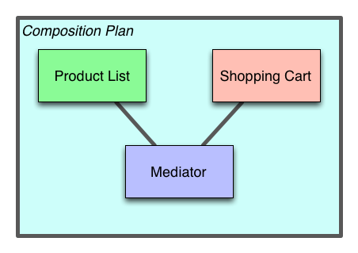

# Connecting your shiz.js with AOP

## Brian Cavalier [@briancavalier](http://twitter.com/briancavalier)

* [cujoJS](http://cujojs.com) co-lead & Spring Javascript @ Pivotal
* http://github.com/briancavalier/aop-jsconf-2013

---

# Two things

* AOP
* Application Composition
	* aka Connecting your shiz.js

---

# AOP

## Aspect Oriented Programming

## Coz you came to JSConf to learn more TLAs

---

# AOP

* *What* Oriented Programming?
* What's an aspect?

---

# AOP

* Aspect: Some encapsulated unit of behavior
* AOP: Technique for composing units of behavior

---

# Ummm

## Sounds fancy, but where I come from, we just call that *programming*

---

# AOP

* controlled - guarantees about *not breaking your stuff*
* non-invasive - without changing the *source code*

---

# AOP

## Guess what? It's easy in JS

```js
var orig = thing.method;

thing.method = function() {
	doAdditionalStuff();
	return orig.apply(thing, arguments);
}
```

---

# AOP

## Guess what? It's easy in JS

* [AOP in 50 LOC](../src/aop-simple.js)
* [cujoJS](http://cujojs.com) - [meld](https://github.com/cujojs/meld)
* [Dojo](http://dojotoolkit.org) - dojo/aspect
* [Flight](http://twitter.github.io/flight/) - flight/advice
* [Hooker](https://github.com/cowboy/javascript-hooker)
* [dcl](https://github.com/uhop/dcl)

---

# Examples

## The required, slightly boring, yet surprisingly illustrative examples

* [Logging](../examples/logging.js)
* [Profiling](../examples/around.js)
* [Memoization](../examples/around.js#L170)

---

# Neato, but yawn

## Users don't actually care about logging, so if that's all we could do, this would be *lame*

---

# Can we

## use this kind of approach to connect more interesting things together?

* Views
* Controllers
* Models
* *Any* application component

---

# Application Composition

## Connecting application components together to make a particular application

* Now *that* sounds useful
* It also sounds a lot like AOP: "composing units of behavior"

---

# Examples

## Let's make a simple app

---



---



---

# Examples

## Let's build it

* [Hardcoded](../demo-app) - [code](../demo-app/vanilla)
* [Events](../demo-app/#events) - [code](../demo-app/events)
* [Pubsub](../demo-app/#pubsub) - [code](../demo-app/pubsub)

---



---



---



---

# Bad

## Components coupled directly to each other, or directly to a connection lib API

---

# Bad

* Lots of mocking to unit test
* Components easily break one another
* Adding new components &rarr; changing source code of existing components
* Changing one component may require
	* updating many mocks
	* re-unit testing all components!

---

# Composition plan

## A *dedicated place* to compose application components

---



---

# Examples

## Let's re-make it using AOP and composition

* [Simple AOP](../demo-app/#aop-simple) - [code](../demo-app/aop-simple)
* [meld.js AOP](../demo-app/#aop-meld) - [code](../demo-app/aop-meld)

---

# Good

* Components have no knowledge of each other
	* unit tests are easy, less mocking
* Change the plan w/o changing the components' source
	* no need to re-run unit tests
* Add new behavior to existing applications
	* minimize regressions
* Create a new plan (i.e. app variant) easily
	* build faster

---

# Testing

## What about testing the *composition*?

* We already do this anyway!
	* Functional testing, e.g. Selenium etc.
* Not a complete solution
	* Sometimes a composition represents *only part* of an application
	* Need test harnesses, but
	* you'd need them no matter what

---

# Composition

## If we're always connecting components in similar ways, can we create a *DSL* to do it?

---

# Yep

## Here's our simple app again

* [cujoJS 1](../demo-app/#cujojs-1) (w/Controller) - [code](../demo-app/cujojs-1)
* [cujoJS 2](../demo-app/#cujojs-2) (Controller-less) - [code](../demo-app/cujojs-2)

---

# AOP

* Add/modify behavior
* Compose components
* Controlled, non-invasive
* Don't need a lib, but they help!

---

# App Composition

* Separate connection from components
* Make a Composition plan
* Test & refactor components easily
* Reduce collateral damage
* Build faster

---

# Links

## AOP

* [AOP @ Wikipedia](http://en.wikipedia.org/wiki/Aspect-oriented_programming)
* [meld.js docs](https://github.com/cujojs/meld/blob/master/docs/TOC.md)
* [Spring AOP](http://static.springsource.org/spring/docs/2.5.5/reference/aop.html)

## AOP libs

* [cujoJS](http://cujojs.com) - [meld](https://github.com/cujojs/meld)
* [Dojo](http://dojotoolkit.org) - dojo/aspect
* [Flight](http://twitter.github.io/flight/) - flight/advice
* [Hooker](https://github.com/cowboy/javascript-hooker)
* [dcl](https://github.com/uhop/dcl)

## Application Composition

* [cujoJS wire.js](http://github.com/cujojs/wire)
* Other JS IOC containers popping up recently

## Example Apps

* [Examples from this talk](../demo-app)
* [cujoJS.com](http://cujojs.com)
* [cujoJS sample apps](http://know.cujojs.com/samples)


